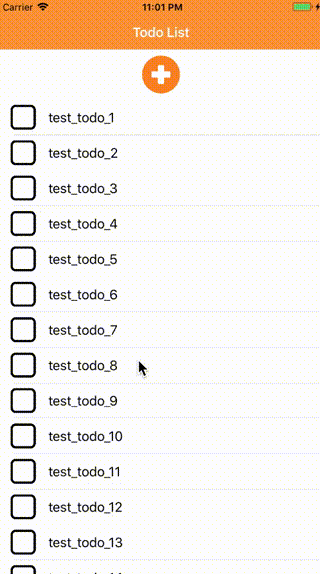

# iOSTodoExam
Todoアプリです.  
Todo一覧画面、Todo作成、編集画面で構成されています。

## 動作デモ
  

## 開発環境  
- Xcode 9.1
- iOS 11+ 

## 使用ライブラリ
- RxSwift
- RxCocoa
- Alamofire
- ObjectMapper
- AlamofireObjectMapper
- Swinject
- SwinjectStoryboard
- RxTest
- RxBlocking

## iOS開発環境について
`pod install`を実行して、ライブラリを使用できるようにしてください。

## APIについて
APIはRails、dockerで作成しています。以下のコマンドで起動してください。APIは3000番ポートを使用します。
```
cd API
docker-compose build
docker-compose up -d
```
以下のコマンドでテストデータを作成することができます。
```
docker-compose run --rm app rake db:seed
```

### APIインターフェース
TodoデータはAPIサーバーによって管理され、Todoモデルはid, title, created_at, updated_atプロパティを持ちます。(iOSアプリ側ではcreated_at, updated_atは使用しません。)

ルーティングは以下の通りです。
```
todo_items GET    /todo_items(.:format)     todo_items#index
           POST   /todo_items(.:format)     todo_items#create
 todo_item GET    /todo_items/:id(.:format) todo_items#show
           PATCH  /todo_items/:id(.:format) todo_items#update
           PUT    /todo_items/:id(.:format) todo_items#update
           DELETE /todo_items/:id(.:format) todo_items#destroy
```

GET(list) /todo_items
```
[
    {
        "created_at": "2017-11-27T14:00:01.476Z", 
        "id": 549, 
        "title": "test_todo_1", 
        "updated_at": "2017-11-27T14:00:01.476Z"
    }, 
    {
        "created_at": "2017-11-27T14:00:01.493Z", 
        "id": 550, 
        "title": "test_todo_2", 
        "updated_at": "2017-11-27T14:00:01.493Z"
    }
]
```

GET  /todo_items
```
{
  "id": 564,
  "title": "Add Todo",
  "created_at": "2017-11-27T14:01:16.385Z",
  "updated_at": "2017-11-27T14:01:16.385Z"
}
```

POST  /todo_items
```
{
	"title" : "test_todo"
}
```

PUT  /todo_items/:id
```
{
	"title" : "hoge_hoge"
}
```

DELETE  /todo_items/:id